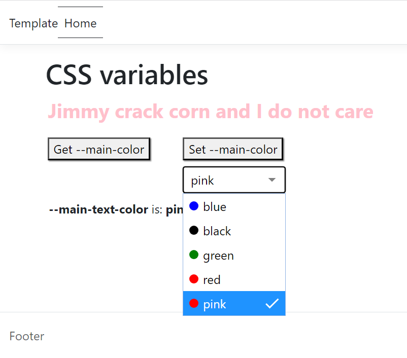

# Using CSS custom properties (variables) in Razor Pages

## Introduction

[CSS custom properties (variables)](https://developer.mozilla.org/en-US/docs/Web/CSS/Using_CSS_custom_properties) are entities defined by the developer that contain specific values to be reused throughout a document.

Custom properties use the notation as follows **--main-text-color: darkgreen;** and when used they are accessed via [var()](https://developer.mozilla.org/en-US/docs/Web/CSS/var) CSS function.

> **Note**
> Variables do not work inside media queries and container queries. The var() function can be used in place of any part of a value in any property on an element. The var() function cannot be used as property names, selectors, or anything else besides property values. So, we can't use it in a media query or container query.

## Basic usage

> **Note**
> Although the sample project has Bootstrap included, Bootstrap is not used for the following samples.



:arrow_forward: For all **H1** elements padding left should be **1.5em**. In a style sheet file add the following.

:arrow_forward: [:root](https://developer.mozilla.org/en-US/docs/Web/CSS/:root) is a  CSS pseudo-class which matches the root element of a tree representing the document. In HTML

```css
:root {
    --h1-left-padding: 1em;
}
```

Also add the rule for **H1** blow the above.

```css
h1 {
    padding-left: var(--h1-left-padding);
}
```

Add a reference for the above style sheet to a Razor Page and add a H1 element which uses the above style.

```html
<h1>CSS variables</h1>
```

Another example is changing a **button** inputs **box-shadow** and on hover, the color.

```css
button {
    box-shadow: .1em .1em .1em var(--shadow-color);
}

button:hover {
    --shadow-color: skyblue;
}
```

## Read/Set CSS properties with JavaScript

Start by aquiring a reference to **:root** in a script section or script file which a page references.

```javascript
const r = document.querySelector(':root');
```

Then use [Window.getComputedStyle()](getComputedStyle) method returns an object containing the values of all CSS properties of an element.

```javascript
var rs = getComputedStyle(r);
```

In this case we want the value for **--main-text-color**, use the following to get the value.

```javascript
rs.getPropertyValue('--main-text-color')
```

## Real life example

The task is to allow visitors to change colors of **P** tags to keep it simple where once they change the color, immediately change the color. To persist consider localstorage if supported.

To give a nice interface the code uses [jsuites.net](https://jsuites.net/v4/) (see used in image above) which can be installed with [libman](https://learn.microsoft.com/en-us/aspnet/core/client-side/libman/libman-vs?view=aspnetcore-7.0).

Once jsuites.net is installed reference these files.

```html
<script src="lib/jsuites/jsuites.js"></script>
<link rel="stylesheet" href="lib/jsuites/jsuites.css" />
```

Add a **div** as follows where the **id** is important as it will be used in code below.

```html
<div>
    <div id="colors" style="margin-left: 13.5em;margin-top:.5em"></div>
</div>
```

**Initializing a dropdown**

- indicate data and note **value** is same as **text** while a developer can set value to a number if needed for referencing other data.
- Set the width
- Set the initial value

```javascript
jSuites.dropdown(document.getElementById('colors'), {
    data: [
        { color: 'blue', value: 'blue', text: 'blue' },
        { color: 'black', value: 'black', text: 'black' },
        { color: 'green', value: 'green', text: 'green' },
        { color: 'red', value: 'red', text: 'red' },
        { color: 'red', value: 'pink', text: 'pink' },

    ],
    width: '135px',
    value: "pink"
});
```

To change the color of all **P** elements to the selected color from the above dropdown.

```javascript
document.documentElement.style
   .setProperty('--main-text-color', document.getElementById("colors").value);
```

## CSS custom properties (variables) support

See the [following page](https://caniuse.com/css-variables).

## Summary

This article has provided the basics for CSS custom properties (variables) with a Razor Page project which allow developers to define values in a single place and reuse them throughout the stylesheet, reducing the need for repetitive code and making it easier to make global changes.

## Source code

Clone the following GitHub repository

